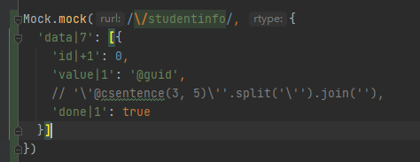
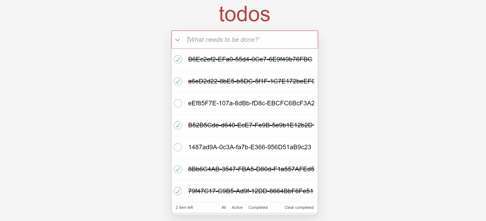

# 用vuejs实现任务记事本
此项目使用vue，vuex,axios以及mock.js来实现任务记事本的功能.

## 技术栈
* vue（核心框架）
* vuex（全局数据流共享）
* mock.js（模拟后端信息）
* axios (发起请求)

## 功能分析与设计
由mockjs模拟后端数据库传入的任务信息,通过页面勾选来改变vuex中数据的状态信息,实现一处修改全局同步,页面部分使用[模板](https://github.com/tastejs/todomvc-app-template )
构建

mockjs配置

效果图

需要改进的有很多，请大家可以多提提意见。后续我会不断改进，如果觉得还可以，请star，你们的star是我前进的动力。
